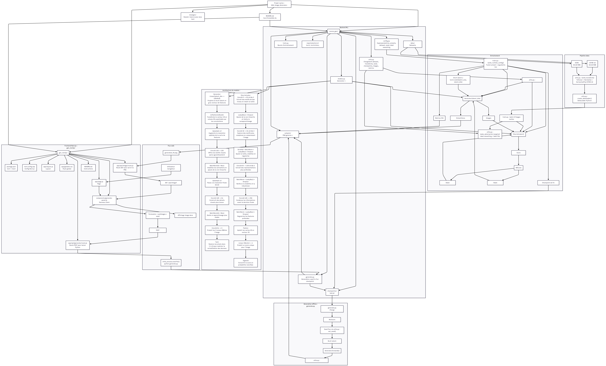

# classicGAN Project

Projet organise autour de deux usages distincts :

- `classicGAN/` : le moteur local pour entrainer le modele, generer des images et produire des apercus.
- `showcase_web/` : la vitrine web statique destinee au deploiement cloud et a la presentation client.

## Structure

- `classicGAN/` : code PyTorch, entrainement, checkpoints, exports.
- `showcase_web/` : application Next.js pour afficher une galerie d'images.
- `request.json` : fichier local temporaire.

## Architecture



Fichier source du schema : [`classicGAN/workflow.png`](classicGAN/workflow.png)

## Lancer le projet depuis GitHub

### 1. Cloner le repo

```powershell
git clone https://github.com/user257814938/GAN_Image_Generator.git
cd GAN_Image_Generator
```

### 2. Faire tourner `classicGAN` en local

```powershell
cd classicGAN
python -m venv .venv
.venv\Scripts\activate
pip install -r requirements.txt
```

Important :

- le code est versionne dans GitHub ;
- les dossiers `data/`, `outputs/` et `checkpoints/` ne sont pas pushes ;
- si tu clones seulement le repo, tu n'auras donc ni dataset local deja telecharge, ni checkpoint pre-entraine.

### 3. Deux options pour demarrer le modele local

**Option A : tu as deja un checkpoint local**

Copie ton fichier `last.pt` ici :

```text
classicGAN/checkpoints/last.pt
```

Puis genere un apercu :

```powershell
python generate.py --checkpoint checkpoints/last.pt --num-images 16
```

**Option B : tu pars uniquement du GitHub**

Il faut reentrainer le modele :

```powershell
python train.py --preset smoke --dataset svhn
```

Puis, pour un entrainement plus long :

```powershell
python train.py --preset improved --dataset svhn
```

Ensuite tu peux generer un apercu :

```powershell
python generate.py --checkpoint checkpoints/last.pt --num-images 16
```

Les apercus seront enregistres dans :

```text
classicGAN/outputs/
```

### 4. Exporter des images vers la vitrine web

Depuis `classicGAN/`, tu peux generer automatiquement un lot d'images pour la vitrine :

```powershell
python export_vercel_gallery.py --count 50
```

Cela remplit :

```text
showcase_web/public/generated/
showcase_web/data/gallery.js
```

## Faire tourner la vitrine web en local

```powershell
cd showcase_web
npm install
npm run dev
```

Puis ouvre :

```text
http://localhost:3000
```

## Deploiement Vercel

- Root Directory : `showcase_web`
- Framework Preset : `Next.js`
- Environment Variables : aucune pour cette version

Logique de deploiement :

- `classicGAN` ne tourne pas sur Vercel ;
- `showcase_web` affiche uniquement les images exportees dans `public/generated/`.
